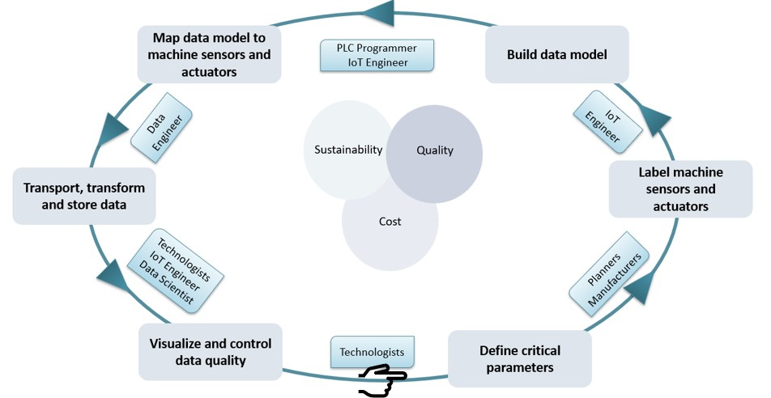
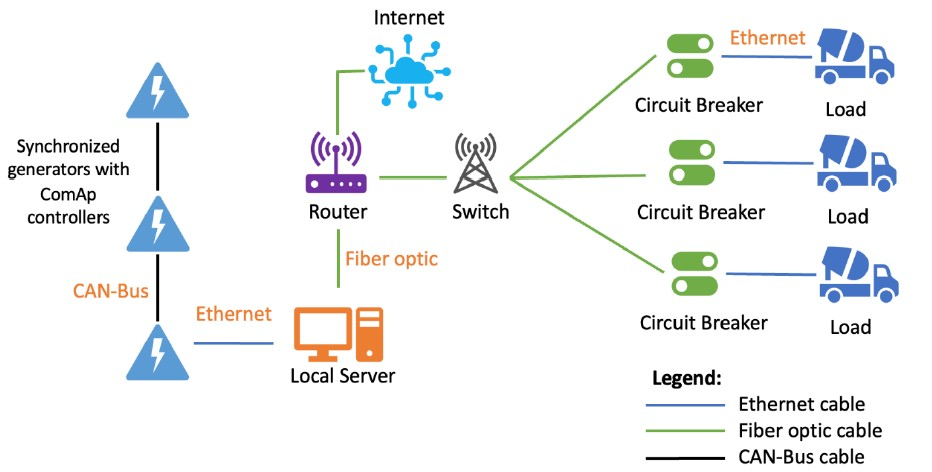
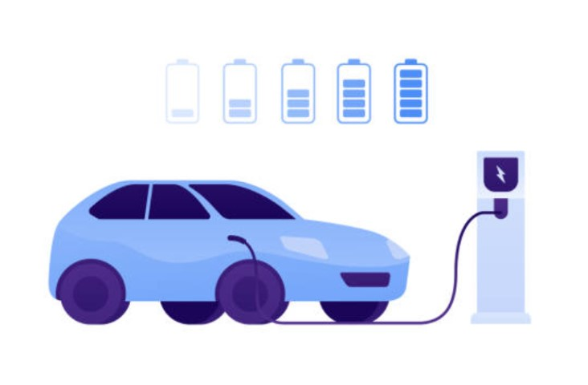
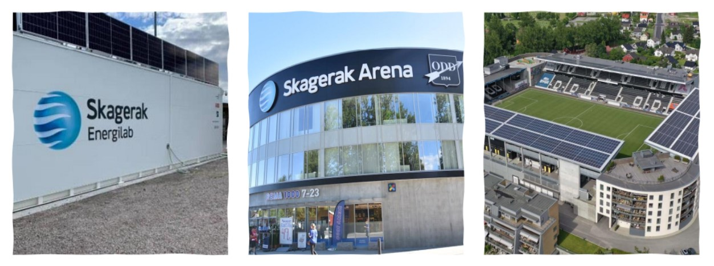
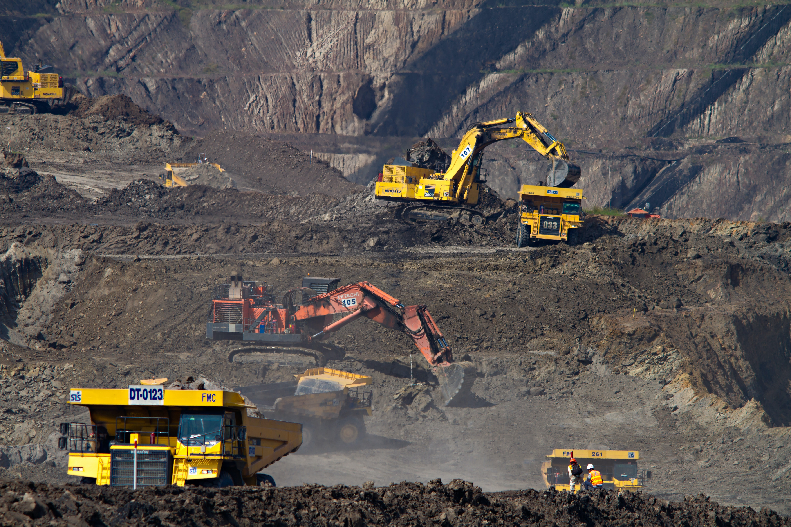
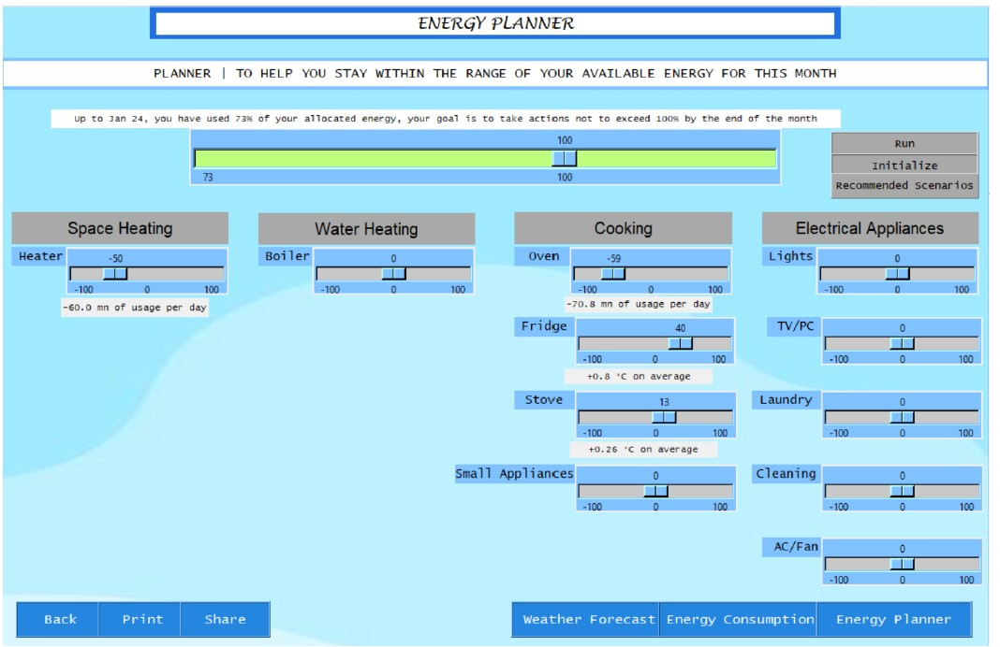
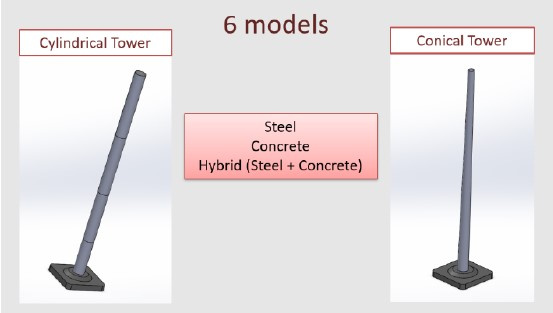

## Selected Projects

**2023**

- **A Methodology for End-to-End Digitalization of Battery Cell Production**  
  **Emmanuel AF Mompremier**
     *This thesis proposes a 6-step methodology to digitalize complex manufacturing processes such as battery cell production from data creation to data storage and tackle limitations to successful implementation of data analytics solutions such as lack of data acquisition, poor data quality and scarcity of usable data.*
     [Slides](static/pdf/Thesis_Presentation.pdf){: .btn}
         

   
   
  
  

  

- **Demand Management for Power-Critical Off-Grid Industrial Applications**  
  **Emmanuel AF Mompremier**, S. Tampoe, N. Hidayati, J. Martinez, J. Dundure
       *This project involves the design of DMSystems, a fast-response demand-management system capable of coping with unexpected reductions in power generation availability and guarding against unforeseen power outages. DMSystems can deliver on the technical requirement of responding to an electrical fault observed through a reduction in grid frequency below the desired threshold with a roundtrip response time of 10 milliseconds.*
   [Report](static/pdf/Challenge_Based_Module_Report.pdf){: .btn}
  [Slides](static/pdf/CBM_Final_Presentation.pdf){: .btn}
  [Demonstration Video]([static/pdf/CBM_Final_Presentation.pdf](https://www.youtube.com/watch?v=oFLpF7w5C1g)){: .btn}
       

   

**2022**

- **Operational Planning: Strategy for Charging a Pool of Electric Vehicles**  
  **Emmanuel AF Mompremier**, P. Losi, O. Olugbayila, Y. Li
       *The challenge is to devise a strategy for charging a pool of electric vehicles in an industrial-like microgrid by minimizing a trade-off between the costs 
      of the electricity purchased to operate the charging station and the penalty incurred to the EV owners if their desired state of charge at departure time is not met. The electricity used in the microgrid can come from the main grid or from PV panels or from both. Additionally, there is a limit on the power that can be imported from or exported to the grid. To design the charging station's controller, the problem is modelled as as a MILP optimization with constraints.*
   [Report](static/pdf/Operational_Planning_Report.pdf){: .btn}
  [Code](https://github.com/emmanuel-mp/operational-planing-charging-pool){: .btn}
       
  

  

- **Optimal Sizing of Microgrids: Case of the Skagerak Stadium in Norway**  
  **Emmanuel AF Mompremier**, N. Hidayati, O. Olugbayila
     *This project focuses on powering a football stadium with combined Photovoltaic and Battery Energy Storage System (BESS) connected to the grid. The distinct 
    load profile of the football stadium and the energy generation coming from PV in Norway results in a significant excess power. This situation leads to the choice 
    to connect the system to the grid with the main objective to sell the excess electricity produced. The project seeks to optimize the size of each sub-system (PV 
   panels & and battery cells), that needs to be installed. In addition to that, analysis of the yearly revenue and the payback period will also be made while taking 
   into account the amount of electricity sold to the grid. The optimization is carried out using the genetic algorithm (GA) method implemented in MATLAB.*  
  [Report](static/pdf/norway_report.pdf){: .btn}
  [Slides](static/pdf/norway_slides.pdf){: .btn}
  [Code](https://github.com/emmanuel-mp/optimal-sizing-stadium/tree/main){: .btn}    

  
   <!--  -->
  

- **Cobalt Mining and the Green Energy Revolution - Case of the Democratic Republic of Congo**  
  **Emmanuel AF Mompremier**, B. Haruna, O. Olugbayila, S. Rostami
       *This paper investigates cobalt mining in the Democratic Republic of Congo and develops a detailed map of all factors playing a role in the
     country’s mineral curse. The implications of the cobalt controversy in DRC and potential impacts on the world at large in the push for green energy as an 
   alternative to fossils are also discussed.*  
    [Report](static/pdf/mining_report.pdf){: .btn}    

  
     <!---->
  

  
  

**2021**

- **A Renewable Energy Community: Technical and Behavioural Design of a Self-Sufficient System**  
  **Emmanuel AF Mompremier**, P. Losi, S. Klaus, Y. Li, J. Dundure
      *Design of an energy system (generation, storage, smart monitoring system) that covers the entire need of a self-sufficient renewable energy community of 11 
   households located in the suburbs of Metz (northeast of France). That community aims to mobilize citizens toward energy transition and improve the flexibility of 
   the electricity system. The project intends to make it possible for such communities to collectively produce, store, consume and monitor their energy effectively. 
   The energy system proposed should allow the inhabitants to be as autonomous as possible in the management of their energy system and energy consumption, and 
   therefore to no longer be dependent on energy suppliers. Furthermore, the proposal should ensure that the system is usable and performs well by integrating user 
   needs and behaviors in the design. Energy+, implemented in the project, is an app to help the users know how their energy is spent and how they can reach their 
   monthly sustainability goal by decreasing their consumption with suitable measures such as energy planning.*  
  [Report](static/pdf/energyplus_report.pdf){: .btn}
  [Demonstration Video](https://www.youtube.com/watch?v=hNCByKByH54){: .btn}
       
    

- **3D Design of an Aircraft Carrier**  
  **Emmanuel AF Mompremier**    
    *Final CAD Design Project*
     [Video](https://www.youtube.com/watch?v=Fx6K5C6MVKo){: .btn}
    [Slides](/static/ppt/gears.ppt){: .btn}
    [Poster](/static/poster/FinalPoster.pdf){: .btn}     

**2020**

- **Analysis of the Strength of Wind Turbine Towers Under Aerodynamic Loads**  
  **Emmanuel AF Mompremier**
   *The study uses Finite Element Analysis to model 6 different types of wind turbine towers and assess their performance under a given set of loads. The finite 
   element models of these 10m-tall towers are analyzed using ABAQUS. Comparison of the deformations, stresses and stability under rotor excitation indicate that the 
   conical steel towers can achieve the best structural performance.*  
   [Paper](static/pdf/towers_paper.pdf){: .btn}
        

- **Green Buildings: A Major Step Toward Energetic Sustainability**  
  **Emmanuel AF Mompremier**  
    *This work points out the threats that buildings and cities pose to the environment in terms of energy consumption and pollution. The report investigates the 
    characteristics of green buildings and their promise to facilitate environmental sustainability.*  
    [Report](static/pdf/Green_Buildings_Report.pdf){: .btn}    
  

- **Cultura Pop Espanola: Las Funciones del Rap**  
 **Emmanuel AF Mompremier**   
    *Clase de Literatura Espanola*  
  [Video](https://youtu.be/AgOV49G6VGo){: .btn}

